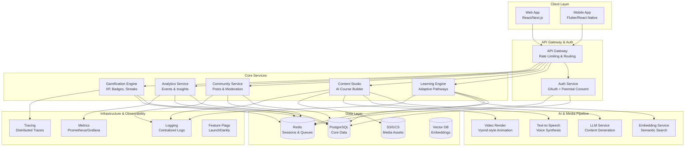
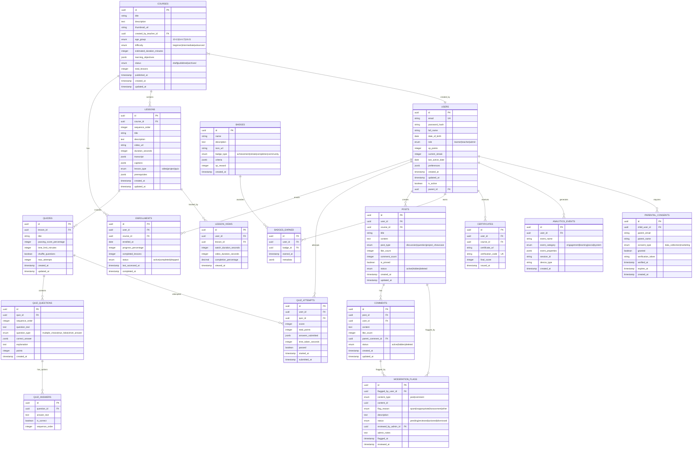

# NDUVA Life Learning Platform - Technical Architecture

## Executive Summary

NDUVA is an adaptive, gamified learning platform for ages 10-21, featuring Vyond-style animated lessons, AI-powered content creation, project-based learning, and community engagement with robust safety controls.

### Brand Voice
- Clear, warm, slightly playful
- Avoid jargon
- Encourage growth and exploration

### Core Principles
- **Mobile-first**: Responsive design, touch-optimized
- **Accessible**: WCAG 2.1 AA compliant
- **Privacy by design**: COPPA & GDPR compliant
- **Evidence of learning**: Reflection + application through projects
- **Healthy motivation**: Streaks/XP without addiction patterns
- **Teacher empowerment**: AI-assisted course creation

---

## 1. High-Level Architecture

### System Components



### Service Responsibilities

#### 1. **API Gateway**
- Request routing
- Rate limiting (by user role, endpoint)
- Request/response transformation
- SSL termination
- CORS handling

#### 2. **Auth Service**
- OAuth 2.0 / OpenID Connect
- Email/password authentication
- Parental consent flows (under 13)
- Session management
- Role-based access control (RBAC)
- JWT token issuance

#### 3. **Learning Engine**
- Course enrollment management
- Lesson progression tracking
- Quiz/assessment delivery
- Adaptive pathway calculation
- Mastery scoring
- Certificate generation

#### 4. **Content Studio**
- AI-assisted course creation
- Script generation (LLM)
- Storyboard tools
- Animation scene builder
- TTS voice generation
- Caption/subtitle management
- Content publishing workflow

#### 5. **Community Service**
- Discussion forums
- User posts & comments
- Moderation queue
- Content flagging
- Automated safety filters
- Escalation workflows

#### 6. **Analytics Service**
- Event ingestion
- Real-time metrics
- Student progress dashboards
- Teacher analytics
- Admin reports
- A/B test tracking

#### 7. **Gamification Engine**
- XP calculation
- Badge awards
- Streak tracking
- Weekly quest generation
- Leaderboard management
- Reward distribution

### Data Flow Patterns

#### Learning Flow
```
Student → Enroll in Course
       → Start Lesson (video + quiz)
       → Submit Quiz Attempt
       → Earn XP & Update Progress
       → Adaptive Engine → Recommend Next Lesson
```

#### Content Creation Flow
```
Teacher → Input Learning Objectives
        → AI generates script
        → Review/Edit Script
        → AI generates storyboard
        → Render animation
        → Generate TTS audio
        → Add captions
        → Publish course
```

#### Community Interaction Flow
```
User → Create Post
     → Automated Filter Check
     → (If flagged) → Moderation Queue
     → (If approved) → Publish
     → Other users engage (like, comment)
```

### Integration Points

#### External AI Services
- **LLM Provider**: OpenAI GPT-4 / Anthropic Claude
  - Course script generation
  - Quiz question generation
  - Feedback personalization
  
- **TTS Provider**: ElevenLabs / Google Cloud TTS
  - Voice synthesis for lessons
  - Multiple voice profiles
  
- **Animation Render**: Custom Vyond-style engine
  - Scene composition
  - Character animation
  - Asset library

#### Storage Strategy
- **PostgreSQL**: Transactional data, user profiles, course structure
- **Redis**: Session store, task queues, real-time leaderboards
- **S3/GCS**: Video files, images, audio, exported certificates
- **Vector DB**: Semantic embeddings for content search

#### Security & Compliance
- **Zero-trust architecture**: Service-to-service mTLS
- **Data encryption**: At rest (AES-256) and in transit (TLS 1.3)
- **PII minimization**: Store only essential data
- **Audit logging**: All data access logged
- **Parental consent**: Verifiable parental consent for users under 13

---

## Deployment Topology

### Production Environment

```
┌─────────────────────────────────────┐
│         CDN (CloudFlare)            │
│  Static Assets, Video Streaming     │
└─────────────────────────────────────┘
                  │
┌─────────────────────────────────────┐
│      Load Balancer (ALB/NLB)        │
│     SSL Termination, DDoS           │
└─────────────────────────────────────┘
                  │
┌─────────────────────────────────────┐
│    Kubernetes Cluster (EKS/GKE)     │
│                                     │
│  ┌──────────┐  ┌──────────┐        │
│  │  Web App │  │   API    │        │
│  │  (Pods)  │  │ Services │        │
│  └──────────┘  └──────────┘        │
│                                     │
│  ┌──────────┐  ┌──────────┐        │
│  │  Workers │  │  AI Jobs │        │
│  │ (Async)  │  │ (Render) │        │
│  └──────────┘  └──────────┘        │
└─────────────────────────────────────┘
                  │
┌─────────────────────────────────────┐
│       Managed Services              │
│  - RDS (PostgreSQL)                 │
│  - ElastiCache (Redis)              │
│  - S3 (Object Storage)              │
│  - Pinecone (Vector DB)             │
└─────────────────────────────────────┘
```

### Scalability Patterns
- **Horizontal scaling**: Auto-scale pods based on CPU/memory
- **Database read replicas**: Separate read/write workloads
- **Cache-aside pattern**: Redis for hot data
- **Event-driven architecture**: Message queues for async work
- **CDN offloading**: Static assets and video streaming

### Disaster Recovery
- **RTO (Recovery Time Objective)**: 4 hours
- **RPO (Recovery Point Objective)**: 15 minutes
- **Multi-region backup**: Cross-region database replication
- **Backup schedule**: Continuous WAL archiving + daily snapshots
- **Failover**: Automated DNS failover to standby region

---

## 2. Entity Relationship Diagram & Data Contracts

### Core Entities Overview



### Data Contracts (JSON Schemas)

#### User Schema
```json
{
  "$schema": "http://json-schema.org/draft-07/schema#",
  "type": "object",
  "properties": {
    "id": { "type": "string", "format": "uuid" },
    "email": { "type": "string", "format": "email" },
    "full_name": { "type": "string", "minLength": 2, "maxLength": 100 },
    "date_of_birth": { "type": "string", "format": "date" },
    "role": { "type": "string", "enum": ["learner", "teacher", "admin"] },
    "xp_points": { "type": "integer", "minimum": 0 },
    "current_streak": { "type": "integer", "minimum": 0 },
    "preferences": {
      "type": "object",
      "properties": {
        "notification_enabled": { "type": "boolean" },
        "theme": { "type": "string", "enum": ["light", "dark", "auto"] },
        "language": { "type": "string" },
        "learning_pace": { "type": "string", "enum": ["relaxed", "moderate", "intensive"] }
      }
    },
    "parent_id": { "type": "string", "format": "uuid", "nullable": true }
  },
  "required": ["email", "full_name", "date_of_birth", "role"]
}
```

#### Course Schema
```json
{
  "$schema": "http://json-schema.org/draft-07/schema#",
  "type": "object",
  "properties": {
    "id": { "type": "string", "format": "uuid" },
    "title": { "type": "string", "minLength": 3, "maxLength": 200 },
    "description": { "type": "string", "maxLength": 5000 },
    "thumbnail_url": { "type": "string", "format": "uri" },
    "created_by_teacher_id": { "type": "string", "format": "uuid" },
    "age_group": { "type": "string", "enum": ["10-13", "14-17", "18-21"] },
    "difficulty": { "type": "string", "enum": ["beginner", "intermediate", "advanced"] },
    "learning_objectives": {
      "type": "array",
      "items": { "type": "string" },
      "minItems": 1,
      "maxItems": 10
    },
    "status": { "type": "string", "enum": ["draft", "published", "archived"] }
  },
  "required": ["title", "description", "created_by_teacher_id", "age_group", "difficulty"]
}
```

#### Quiz Attempt Schema
```json
{
  "$schema": "http://json-schema.org/draft-07/schema#",
  "type": "object",
  "properties": {
    "id": { "type": "string", "format": "uuid" },
    "user_id": { "type": "string", "format": "uuid" },
    "quiz_id": { "type": "string", "format": "uuid" },
    "score": { "type": "integer", "minimum": 0 },
    "total_points": { "type": "integer", "minimum": 0 },
    "answers_submitted": {
      "type": "object",
      "patternProperties": {
        "^[0-9a-f-]{36}$": {
          "type": "object",
          "properties": {
            "answer": { "type": ["string", "array", "boolean"] },
            "is_correct": { "type": "boolean" },
            "points_earned": { "type": "integer" }
          }
        }
      }
    },
    "passed": { "type": "boolean" },
    "started_at": { "type": "string", "format": "date-time" },
    "submitted_at": { "type": "string", "format": "date-time" }
  },
  "required": ["user_id", "quiz_id", "score", "total_points", "passed"]
}
```

### Storage Strategy & Retention

#### PostgreSQL Tables
- **Hot data**: Active user sessions, current enrollments, recent posts
- **Warm data**: Historical quiz attempts, older posts, analytics events
- **Partitioning**: Analytics events partitioned by month
- **Indexing**: 
  - B-tree on foreign keys and frequently queried fields
  - GiST on JSONB columns for preferences
  - Partial indexes on active/published content

#### Redis Data Structures
```
# Session Management
session:{user_id} → Hash (user data, expiry: 24h)

# Real-time Leaderboards
leaderboard:weekly → Sorted Set (score: xp_points)
leaderboard:monthly → Sorted Set (score: xp_points)

# Task Queues
queue:video_render → List (job payloads)
queue:certificate_generate → List (job payloads)

# Rate Limiting
ratelimit:{user_id}:{endpoint} → String (counter, expiry: 1h)

# Streak Cache
streak:{user_id} → Hash (last_active, current_streak, expiry: 48h)
```

#### S3/GCS Buckets
- **Videos**: `/courses/{course_id}/lessons/{lesson_id}/video.mp4`
- **Thumbnails**: `/courses/{course_id}/thumbnail.jpg`
- **Certificates**: `/certificates/{user_id}/{course_id}/cert.pdf`
- **User uploads**: `/uploads/{user_id}/{timestamp}/{filename}`
- **Lifecycle**: Archive to Glacier after 1 year

#### Vector Database (Pinecone/Weaviate)
- **Content embeddings**: Course descriptions, lesson transcripts
- **Dimension**: 1536 (OpenAI ada-002)
- **Metadata filters**: age_group, difficulty, topic
- **Use case**: Semantic course search, content recommendations

### Data Retention Policy

| Data Type | Retention Period | Action After |
|-----------|------------------|--------------|
| Active user data | Indefinite | Delete on account closure |
| Quiz attempts | 2 years | Archive to cold storage |
| Analytics events | 13 months | Aggregate & delete raw |
| Session logs | 30 days | Delete |
| Moderation flags | 1 year | Archive |
| User-generated content | Per user request | Delete (GDPR/CCPA) |
| Certificates | 10 years | Archive to S3 Glacier |
| Audit logs | 7 years | Compliance requirement |

---

## 3. API Surface Design

### API Architecture

**Protocol**: REST + GraphQL hybrid
- **REST**: CRUD operations, authentication, file uploads
- **GraphQL**: Complex queries, real-time subscriptions (learning progress, community)

**Base URL**: `https://api.nduva.com/v1`

### Authentication & Authorization

#### Auth Flow

1. **Standard Login** (Email/Password or OAuth)
```http
POST /auth/login
Content-Type: application/json

{
  "email": "student@example.com",
  "password": "securepassword"
}

Response 200:
{
  "access_token": "eyJhbGc...",
  "refresh_token": "dGhpcyBp...",
  "token_type": "Bearer",
  "expires_in": 3600,
  "user": { /* user object */ }
}
```

2. **Parental Consent Flow** (For users under 13)
```http
POST /auth/register/child
Content-Type: application/json

{
  "child": {
    "full_name": "John Doe",
    "date_of_birth": "2015-03-20",
    "email": "john@example.com"
  },
  "parent": {
    "full_name": "Jane Doe",
    "email": "jane@example.com"
  }
}

Response 201:
{
  "message": "Verification email sent to parent",
  "verification_id": "uuid",
  "status": "pending_consent"
}
```

3. **OAuth Providers**
   - Google: `/auth/oauth/google`
   - Microsoft: `/auth/oauth/microsoft`
   - Apple: `/auth/oauth/apple`

#### Auth Scopes

| Scope | Description | Roles |
|-------|-------------|-------|
| `user:read` | Read own user profile | All |
| `user:write` | Update own user profile | All |
| `course:read` | View courses | All |
| `course:write` | Create/edit courses | Teacher, Admin |
| `course:publish` | Publish courses | Teacher, Admin |
| `enrollment:manage` | Enroll in courses | Learner |
| `quiz:attempt` | Submit quiz attempts | Learner |
| `community:read` | View posts/comments | All |
| `community:write` | Create posts/comments | All |
| `moderation:manage` | Moderate content | Admin |
| `analytics:read` | View analytics | Teacher, Admin |
| `admin:all` | Full admin access | Admin |

### Core API Endpoints

#### 1. User Management

```http
# Get current user
GET /users/me
Authorization: Bearer {token}
Response: User object

# Update user profile
PATCH /users/me
Authorization: Bearer {token}
Content-Type: application/json
Body: Partial User object
Response: Updated User object

# Get user's XP and streaks
GET /users/me/gamification
Authorization: Bearer {token}
Response: {
  "xp_points": 1250,
  "current_streak": 7,
  "badges_earned": 5,
  "rank": "Bronze Scholar"
}

# Rate Limit: 100 req/hour per user
```

#### 2. Course Management

```http
# List courses (with filters)
GET /courses?age_group=14-17&difficulty=beginner&page=1&limit=20
Authorization: Bearer {token}
Response: {
  "data": [Course[]],
  "pagination": {
    "page": 1,
    "total_pages": 5,
    "total_items": 100
  }
}

# Get course details
GET /courses/{courseId}
Authorization: Bearer {token}
Response: Course object with lessons[]

# Create course (Teacher only)
POST /courses
Authorization: Bearer {token}
Scope: course:write
Content-Type: application/json
Body: {
  "title": "Financial Literacy 101",
  "description": "...",
  "age_group": "14-17",
  "difficulty": "beginner",
  "learning_objectives": ["Understand budgeting", "..."]
}
Response 201: Created Course object

# Update course
PATCH /courses/{courseId}
Authorization: Bearer {token}
Scope: course:write
Content-Type: application/json
Body: Partial Course object

# Publish course
POST /courses/{courseId}/publish
Authorization: Bearer {token}
Scope: course:publish
Response: { "status": "published", "published_at": "2024-01-15T10:00:00Z" }

# Rate Limit: 
#  - GET: 500 req/hour
#  - POST/PATCH: 100 req/hour
```

#### 3. Enrollment & Progress

```http
# Enroll in course
POST /enrollments
Authorization: Bearer {token}
Scope: enrollment:manage
Content-Type: application/json
Body: { "course_id": "uuid" }
Response 201: Enrollment object

# Get my enrollments
GET /enrollments/me?status=active
Authorization: Bearer {token}
Response: Enrollment[]

# Get enrollment progress
GET /enrollments/{enrollmentId}/progress
Authorization: Bearer {token}
Response: {
  "enrollment_id": "uuid",
  "progress_percentage": 65,
  "completed_lessons": 13,
  "total_lessons": 20,
  "current_lesson": { /* lesson object */ },
  "next_lesson": { /* adaptive recommendation */ }
}

# Mark lesson as viewed
POST /enrollments/{enrollmentId}/lessons/{lessonId}/view
Authorization: Bearer {token}
Content-Type: application/json
Body: {
  "watch_duration_seconds": 120,
  "completion_percentage": 100
}
Response: { "xp_earned": 50, "lesson_completed": true }

# Rate Limit: 200 req/hour
```

#### 4. Quizzes & Assessments

```http
# Get quiz
GET /quizzes/{quizId}
Authorization: Bearer {token}
Response: Quiz with questions[] (without correct answers)

# Submit quiz attempt
POST /quiz-attempts
Authorization: Bearer {token}
Scope: quiz:attempt
Content-Type: application/json
Body: {
  "quiz_id": "uuid",
  "answers": {
    "question_uuid": { "answer": "option_a" },
    "question_uuid_2": { "answer": ["opt1", "opt2"] }
  },
  "time_taken_seconds": 300
}
Response 201: {
  "attempt_id": "uuid",
  "score": 85,
  "total_points": 100,
  "passed": true,
  "xp_earned": 100,
  "feedback": { /* detailed feedback per question */ }
}

# Get quiz attempts history
GET /quiz-attempts?user_id=me&quiz_id={quizId}
Authorization: Bearer {token}
Response: QuizAttempt[]

# Rate Limit: 50 quiz attempts/day per user
```

#### 5. Adaptive Learning

```http
# Get personalized recommendations
GET /recommendations/next-lessons
Authorization: Bearer {token}
Query Params:
  - enrollment_id: uuid
  - count: integer (default: 5)
Response: {
  "recommendations": [
    {
      "lesson_id": "uuid",
      "lesson": { /* lesson object */ },
      "reason": "Based on your progress in similar topics",
      "confidence_score": 0.87
    }
  ]
}

# Get learning path
GET /recommendations/learning-path
Authorization: Bearer {token}
Query Params:
  - enrollment_id: uuid
Response: {
  "path": [
    { "lesson_id": "uuid", "sequence": 1, "estimated_duration": 15 },
    { "lesson_id": "uuid", "sequence": 2, "estimated_duration": 20 }
  ],
  "total_duration_minutes": 180,
  "adaptive_adjustments": []
}

# Rate Limit: 100 req/hour
```

#### 6. Community

```http
# List posts (with filters)
GET /posts?course_id={uuid}&post_type=discussion&page=1
Authorization: Bearer {token}
Response: {
  "data": Post[],
  "pagination": { /* ... */ }
}

# Create post
POST /posts
Authorization: Bearer {token}
Scope: community:write
Content-Type: application/json
Body: {
  "course_id": "uuid",
  "title": "How to budget effectively?",
  "content": "I'm struggling with...",
  "post_type": "question"
}
Response 201: Post object

# Add comment
POST /posts/{postId}/comments
Authorization: Bearer {token}
Content-Type: application/json
Body: {
  "content": "Great question! Here's my approach...",
  "parent_comment_id": null
}
Response 201: Comment object

# Flag content
POST /moderation/flag
Authorization: Bearer {token}
Content-Type: application/json
Body: {
  "content_type": "post",
  "content_id": "uuid",
  "flag_reason": "inappropriate",
  "description": "Contains offensive language"
}
Response 201: { "flag_id": "uuid", "status": "pending" }

# Rate Limit:
#  - GET: 500 req/hour
#  - POST: 50 posts/day, 200 comments/day
```

#### 7. Gamification

```http
# Get user badges
GET /badges/me
Authorization: Bearer {token}
Response: {
  "badges_earned": [
    {
      "badge": { /* badge object */ },
      "earned_at": "2024-01-10T14:30:00Z"
    }
  ],
  "next_badges": [ /* badges close to earning */ ]
}

# Get leaderboard
GET /leaderboard?type=weekly&limit=100
Authorization: Bearer {token}
Response: {
  "leaderboard": [
    {
      "rank": 1,
      "user": { "id": "uuid", "full_name": "Jane D." },
      "xp_points": 2500,
      "badges_count": 12
    }
  ],
  "my_rank": 45
}

# Get weekly quests
GET /quests/weekly
Authorization: Bearer {token}
Response: {
  "quests": [
    {
      "id": "uuid",
      "title": "Complete 5 lessons this week",
      "progress": 3,
      "target": 5,
      "xp_reward": 200,
      "expires_at": "2024-01-21T23:59:59Z"
    }
  ]
}

# Rate Limit: 200 req/hour
```

#### 8. Analytics (Teacher/Admin)

```http
# Get student analytics
GET /analytics/students/{studentId}
Authorization: Bearer {token}
Scope: analytics:read
Response: {
  "student_id": "uuid",
  "total_courses_enrolled": 5,
  "courses_completed": 2,
  "average_quiz_score": 87.5,
  "total_xp": 3500,
  "learning_pace": "moderate",
  "engagement_metrics": {
    "lessons_per_week": 4.2,
    "avg_session_duration_minutes": 25
  }
}

# Get course analytics
GET /analytics/courses/{courseId}
Authorization: Bearer {token}
Scope: analytics:read
Response: {
  "enrollment_count": 1250,
  "completion_rate": 67.5,
  "average_rating": 4.6,
  "lesson_performance": [ /* per-lesson stats */ ]
}

# Rate Limit: 100 req/hour
```

#### 9. Content Studio (AI-Assisted)

```http
# Generate course script
POST /content-studio/generate-script
Authorization: Bearer {token}
Scope: course:write
Content-Type: application/json
Body: {
  "topic": "Introduction to Budgeting",
  "age_group": "14-17",
  "duration_minutes": 10,
  "learning_objectives": ["Understand income vs expenses", "..."]
}
Response 202: {
  "job_id": "uuid",
  "status": "processing",
  "estimated_completion_seconds": 30
}

# Check script generation status
GET /content-studio/jobs/{jobId}
Authorization: Bearer {token}
Response: {
  "job_id": "uuid",
  "status": "completed",
  "result": {
    "script": "Welcome to budgeting basics...",
    "scenes": [ /* storyboard */ ]
  }
}

# Render video
POST /content-studio/render-video
Authorization: Bearer {token}
Content-Type: application/json
Body: {
  "script": "...",
  "scenes": [ /* ... */ ],
  "voice_id": "professional_female",
  "background_music": true
}
Response 202: {
  "render_job_id": "uuid",
  "status": "queued",
  "estimated_completion_minutes": 5
}

# Rate Limit: 10 AI generations/hour per teacher
```

### GraphQL Schema (Subset)

```graphql
type Query {
  me: User!
  course(id: ID!): Course
  courses(filters: CourseFilters, page: Int, limit: Int): CoursePage!
  enrollment(id: ID!): Enrollment
  myEnrollments(status: EnrollmentStatus): [Enrollment!]!
  recommendations(enrollmentId: ID!, count: Int): [LessonRecommendation!]!
  leaderboard(type: LeaderboardType!, limit: Int): Leaderboard!
  posts(filters: PostFilters, page: Int): PostPage!
}

type Mutation {
  enrollInCourse(courseId: ID!): Enrollment!
  submitQuizAttempt(input: QuizAttemptInput!): QuizAttemptResult!
  createPost(input: CreatePostInput!): Post!
  flagContent(input: FlagContentInput!): ModerationFlag!
  updateUserPreferences(input: UserPreferencesInput!): User!
}

type Subscription {
  lessonProgress(enrollmentId: ID!): LessonProgressUpdate!
  liveLeaderboard(type: LeaderboardType!): LeaderboardUpdate!
  communityActivity(courseId: ID!): CommunityUpdate!
}
```

### Rate Limiting Strategy

#### Tier-based Limits

| Tier | Requests/Hour | Burst | AI Requests/Day |
|------|---------------|-------|-----------------|
| Free Learner | 500 | 100 | N/A |
| Premium Learner | 1000 | 200 | N/A |
| Teacher | 2000 | 400 | 100 |
| Admin | 10000 | 2000 | 500 |

#### Endpoint-Specific Limits
- **Quiz Attempts**: Max 50/day per user
- **Post Creation**: Max 20/day per user
- **Comment Creation**: Max 100/day per user
- **AI Content Generation**: 10/hour for teachers
- **Video Upload**: Max 5GB/day per teacher

#### Rate Limit Headers
```http
X-RateLimit-Limit: 1000
X-RateLimit-Remaining: 847
X-RateLimit-Reset: 1704672000
```

### Error Responses

#### Standard Error Format
```json
{
  "error": {
    "code": "VALIDATION_ERROR",
    "message": "Invalid input data",
    "details": [
      {
        "field": "age_group",
        "message": "Must be one of: 10-13, 14-17, 18-21"
      }
    ],
    "request_id": "req_abc123",
    "timestamp": "2024-01-15T10:30:00Z"
  }
}
```

#### Error Codes

| Code | HTTP Status | Description |
|------|-------------|-------------|
| `AUTHENTICATION_REQUIRED` | 401 | Missing or invalid token |
| `INSUFFICIENT_PERMISSIONS` | 403 | Lacks required scope |
| `RESOURCE_NOT_FOUND` | 404 | Requested resource doesn't exist |
| `VALIDATION_ERROR` | 422 | Invalid input data |
| `RATE_LIMIT_EXCEEDED` | 429 | Too many requests |
| `PARENTAL_CONSENT_REQUIRED` | 451 | User under 13 needs consent |
| `INTERNAL_ERROR` | 500 | Server error |

### API Versioning

- **URL Versioning**: `/v1/`, `/v2/`
- **Header Versioning**: `API-Version: 2024-01-15`
- **Deprecation Policy**: 6-month notice, 12-month support
- **Sunset Header**: `Sunset: Sat, 31 Dec 2024 23:59:59 GMT`

---

## 4. Adaptive Learning Engine

### Overview

The adaptive engine personalizes learning paths based on real-time performance signals, learning pace, and mastery indicators.

### Architecture

```
┌─────────────────┐
│  Signal         │
│  Collection     │
└────────┬────────┘
         │
         ▼
┌─────────────────┐      ┌──────────────┐
│  Mastery        │◄─────┤  Historical  │
│  Calculation    │      │  Performance │
└────────┬────────┘      └──────────────┘
         │
         ▼
┌─────────────────┐
│  Policy         │
│  Engine         │
└────────┬────────┘
         │
         ▼
┌─────────────────┐
│  Recommendation │
│  Generator      │
└────────┬────────┘
         │
         ▼
┌─────────────────┐
│  Next Lesson(s) │
└─────────────────┘
```

### Signal Collection

#### Primary Signals
```json
{
  "quiz_performance": {
    "score": 0.85,
    "time_taken_ratio": 0.7,
    "attempts_count": 1,
    "question_level_accuracy": {
      "easy": 1.0,
      "medium": 0.8,
      "hard": 0.6
    }
  },
  "video_engagement": {
    "completion_rate": 0.95,
    "rewatch_count": 2,
    "pause_points": [45, 120],
    "playback_speed": 1.0
  },
  "time_metrics": {
    "lesson_start_time": "2024-01-15T14:00:00Z",
    "lesson_end_time": "2024-01-15T14:25:00Z",
    "idle_time_seconds": 120
  },
  "historical_patterns": {
    "avg_quiz_score_last_5": 0.82,
    "preferred_learning_time": "afternoon",
    "avg_session_duration_minutes": 30,
    "topic_affinity": {"budgeting": 0.9, "investing": 0.7}
  }
}
```

#### Derived Metrics
- **Mastery Score** (0-100): Weighted combination of quiz scores, attempts, and engagement
- **Learning Velocity**: Lessons completed per week
- **Struggle Indicators**: Multiple attempts, low completion rates, frequent pauses
- **Engagement Index**: Watch time, interaction rate, return frequency

### Mastery Calculation

#### Formula
```python
def calculate_mastery(signals):
    weights = {
        'quiz_score': 0.4,
        'quiz_attempts': 0.15,  # Inverse weight
        'video_completion': 0.2,
        'time_efficiency': 0.15,
        'prior_knowledge': 0.1
    }
    
    quiz_component = signals.quiz_score * weights['quiz_score']
    attempts_component = (1 / signals.attempts_count) * weights['quiz_attempts']
    video_component = signals.completion_rate * weights['video_completion']
    time_component = min(1.0, signals.expected_time / signals.actual_time) * weights['time_efficiency']
    prior_component = signals.topic_affinity * weights['prior_knowledge']
    
    mastery = (quiz_component + attempts_component + video_component + 
               time_component + prior_component)
    
    return round(mastery * 100, 2)
```

#### Mastery Levels
| Score | Level | Interpretation |
|-------|-------|----------------|
| 90-100 | Mastered | Ready for advanced topics |
| 75-89 | Proficient | Can proceed, may need review |
| 60-74 | Developing | Needs practice before advancing |
| 0-59 | Beginning | Requires additional support |

### Policy Engine

#### Recommendation Policies

1. **Sequential Progression** (Default)
   - Condition: Mastery ≥ 75%
   - Action: Recommend next lesson in sequence
   
2. **Reinforcement**
   - Condition: Mastery < 75% or Failed quiz
   - Action: Recommend review lessons or alternative explanations
   
3. **Challenge Mode**
   - Condition: Mastery ≥ 90% consistently
   - Action: Skip optional lessons, recommend advanced content
   
4. **Remediation**
   - Condition: 3+ failed attempts or Mastery < 60%
   - Action: Recommend prerequisite lessons or simpler content

5. **Topic Affinity**
   - Condition: High engagement in specific topic
   - Action: Recommend related courses/lessons

#### Policy Decision Tree
```
Start
  │
  ├─ Mastery ≥ 90%?
  │    ├─ Yes → Challenge Mode (skip/advanced)
  │    └─ No ↓
  │
  ├─ Mastery ≥ 75%?
  │    ├─ Yes → Sequential Progression
  │    └─ No ↓
  │
  ├─ Mastery ≥ 60%?
  │    ├─ Yes → Reinforcement (practice)
  │    └─ No ↓
  │
  └─ Mastery < 60%
       └─ Remediation (prerequisite)
```

### Recommendation Algorithm

#### Hybrid Approach: Rule-based + Collaborative Filtering

```python
def generate_recommendations(user_id, enrollment_id, count=5):
    # 1. Get current state
    mastery = calculate_mastery(user_id, enrollment_id)
    learning_pace = get_learning_pace(user_id)
    
    # 2. Apply policy
    policy = determine_policy(mastery)
    
    # 3. Get candidate lessons
    if policy == 'sequential':
        candidates = get_next_in_sequence(enrollment_id)
    elif policy == 'reinforcement':
        candidates = get_review_lessons(enrollment_id)
    elif policy == 'challenge':
        candidates = get_advanced_lessons(enrollment_id)
    elif policy == 'remediation':
        candidates = get_prerequisite_lessons(enrollment_id)
    
    # 4. Apply collaborative filtering
    similar_users = find_similar_learners(user_id)
    cf_scores = calculate_cf_scores(candidates, similar_users)
    
    # 5. Rank and return
    ranked = rank_by_combined_score(
        candidates,
        policy_weight=0.7,
        cf_weight=0.3
    )
    
    return ranked[:count]
```

#### Similarity Metrics (Collaborative Filtering)
```python
def find_similar_learners(user_id):
    features = [
        'age_group',
        'avg_quiz_score',
        'learning_pace',
        'topic_preferences',
        'engagement_patterns'
    ]
    
    # Cosine similarity on feature vectors
    user_vector = get_user_vector(user_id, features)
    all_users = get_all_learners()
    
    similarities = []
    for other_user in all_users:
        if other_user.id == user_id:
            continue
        other_vector = get_user_vector(other_user.id, features)
        sim = cosine_similarity(user_vector, other_vector)
        similarities.append((other_user.id, sim))
    
    return sorted(similarities, key=lambda x: x[1], reverse=True)[:50]
```

### Fallback & Edge Cases

#### When Insufficient Data
- **New users**: Default to sequential progression
- **No similar users**: Use content-based filtering (lesson metadata)
- **API timeout**: Return cached recommendations

#### Performance Optimization
- **Pre-computation**: Calculate recommendations daily for active users
- **Caching**: Redis cache with 1-hour TTL
- **Batch processing**: Update mastery scores asynchronously

### Evaluation Metrics

Track recommendation quality:
- **Click-through Rate (CTR)**: % of recommended lessons started
- **Completion Rate**: % of recommended lessons finished
- **Learning Outcomes**: Avg quiz score on recommended content
- **Time-to-Mastery**: Days to reach 90% mastery

#### A/B Testing Framework
```json
{
  "experiment_id": "adaptive_v2_vs_v1",
  "variants": [
    {
      "name": "control",
      "algorithm": "sequential_only",
      "traffic_percentage": 50
    },
    {
      "name": "treatment",
      "algorithm": "hybrid_adaptive",
      "traffic_percentage": 50
    }
  ],
  "metrics": ["ctr", "completion_rate", "quiz_score", "engagement_time"],
  "duration_days": 30
}
```

---

## 5. Content Pipeline (AI-Assisted)

### Pipeline Stages

```
Teacher Input
    ↓
[1] Prompt Engineering → LLM
    ↓
[2] Script Generation
    ↓
[3] Storyboard Creation
    ↓
[4] Scene Rendering (Vyond-style)
    ↓
[5] Voice Synthesis (TTS)
    ↓
[6] Caption Generation
    ↓
[7] Video Compositing
    ↓
[8] Quality Check & Moderation
    ↓
Published Lesson
```

### Stage 1: Prompt Engineering

#### Input from Teacher
```json
{
  "topic": "Introduction to Compound Interest",
  "age_group": "14-17",
  "duration_minutes": 8,
  "learning_objectives": [
    "Define compound interest",
    "Understand the difference from simple interest",
    "Calculate compound interest using formula"
  ],
  "tone": "friendly, encouraging",
  "complexity": "beginner"
}
```

#### LLM Prompt Template
```
You are an expert educational content creator for ages {age_group}.
Create a {duration_minutes}-minute lesson script on "{topic}".

Learning Objectives:
{objectives_list}

Requirements:
- Tone: {tone}
- Use age-appropriate language
- Include 2-3 real-world examples
- Add interactive moments (questions, think-pauses)
- Structure: Hook → Explanation → Examples → Summary
- Include visual cues for animation

Output Format:
{
  "hook": "Opening 30 seconds to grab attention",
  "main_content": [
    {
      "segment_title": "...",
      "narration": "...",
      "visual_cue": "...",
      "duration_seconds": 60
    }
  ],
  "examples": [...],
  "summary": "..."
}
```

### Stage 2: Script Generation

#### LLM Output (GPT-4 / Claude)
```json
{
  "script_id": "uuid",
  "hook": {
    "narration": "Imagine earning money while you sleep...",
    "visual_cue": "Animation of money growing on a tree",
    "duration_seconds": 30
  },
  "segments": [
    {
      "title": "What is Compound Interest?",
      "narration": "Compound interest is like a snowball rolling down a hill...",
      "visual_cue": "Snowball growing animation",
      "duration_seconds": 90,
      "interaction": {
        "type": "pause_and_think",
        "question": "Can you think of where you've seen compound interest?"
      }
    }
  ],
  "summary": {
    "narration": "Remember: compound interest helps your money grow faster...",
    "visual_cue": "Key points appearing on screen",
    "duration_seconds": 45
  },
  "total_duration": 480
}
```

### Stage 3: Storyboard Creation

#### Scene Composition
```json
{
  "scene_id": "scene_001",
  "timestamp": "00:00:30",
  "duration": 15,
  "background": {
    "type": "classroom",
    "color_palette": "warm"
  },
  "characters": [
    {
      "id": "teacher_avatar",
      "position": "center",
      "expression": "friendly",
      "animation": "pointing_to_board"
    }
  ],
  "props": [
    {
      "type": "whiteboard",
      "content": "A = P(1 + r/n)^(nt)",
      "position": "background_center"
    }
  ],
  "transitions": {
    "in": "fade",
    "out": "slide_left"
  }
}
```

### Stage 4: Video Rendering (Vyond-style)

#### Asset Library
- **Characters**: 20+ diverse avatars (age, ethnicity, style)
- **Backgrounds**: 50+ scenes (classroom, home, office, outdoor)
- **Props**: 200+ objects (charts, devices, everyday items)
- **Animations**: 100+ actions (talking, walking, gesturing)

#### Rendering Engine
```python
class VideoRenderer:
    def render_scene(self, scene_data):
        # 1. Load assets
        background = load_background(scene_data.background)
        characters = [load_character(c) for c in scene_data.characters]
        props = [load_prop(p) for p in scene_data.props]
        
        # 2. Compose scene
        frame = composite_layers(background, characters, props)
        
        # 3. Apply animations
        animated_frame = apply_animations(frame, scene_data.animations)
        
        # 4. Render at 30fps
        video_clip = render_video(
            animated_frame,
            duration=scene_data.duration,
            fps=30,
            resolution='1080p'
        )
        
        return video_clip
    
    def render_lesson(self, storyboard):
        clips = [self.render_scene(scene) for scene in storyboard.scenes]
        final_video = concatenate_clips(clips)
        return final_video
```

### Stage 5: Voice Synthesis (TTS)

#### Voice Profiles
| Voice ID | Description | Use Case |
|----------|-------------|----------|
| `friendly_female` | Warm, encouraging | General lessons (ages 10-17) |
| `professional_male` | Clear, authoritative | Advanced topics (ages 18-21) |
| `energetic_young` | Upbeat, playful | Interactive segments |
| `calm_narrator` | Soothing, measured | Complex explanations |

#### TTS Generation
```python
def generate_voiceover(script, voice_id='friendly_female'):
    segments = []
    
    for segment in script.segments:
        audio = tts_engine.synthesize(
            text=segment.narration,
            voice=voice_id,
            speed=0.95,  # Slightly slower for clarity
            emphasis_words=segment.key_terms
        )
        
        # Add pauses for interaction points
        if segment.interaction:
            audio = add_pause(audio, duration=3)
        
        segments.append(audio)
    
    return concatenate_audio(segments)
```

### Stage 6: Caption Generation

#### Auto-caption with Timestamps
```json
{
  "captions": [
    {
      "start_time": "00:00:00",
      "end_time": "00:00:04",
      "text": "Imagine earning money while you sleep."
    },
    {
      "start_time": "00:00:04",
      "end_time": "00:00:08",
      "text": "That's the power of compound interest!"
    }
  ],
  "language": "en",
  "format": "WebVTT"
}
```

### Stage 7: Video Compositing

```python
def composite_final_video(video_clip, audio, captions):
    # 1. Sync audio with video
    final = video_clip.set_audio(audio)
    
    # 2. Add captions
    final = add_subtitles(final, captions, style={
        'font': 'Arial',
        'size': 24,
        'color': 'white',
        'background': 'rgba(0,0,0,0.7)',
        'position': 'bottom'
    })
    
    # 3. Add branding
    final = add_logo_watermark(final, position='top_right', opacity=0.3)
    
    # 4. Export
    final.write_videofile(
        'output.mp4',
        codec='h264',
        audio_codec='aac',
        bitrate='5000k'
    )
    
    return 'output.mp4'
```

### Stage 8: Quality Check & Moderation

#### Automated Checks
```python
def quality_assurance(video_path, script):
    checks = {
        'duration_match': check_duration(video_path, script.total_duration),
        'audio_quality': check_audio_levels(video_path),
        'caption_sync': verify_caption_timing(video_path),
        'content_safety': scan_for_inappropriate_content(video_path),
        'accessibility': check_wcag_compliance(video_path)
    }
    
    if all(checks.values()):
        return {"status": "approved", "checks": checks}
    else:
        return {"status": "needs_review", "failed_checks": [k for k, v in checks.items() if not v]}
```

#### Manual Review Triggers
- Content safety flags
- Audio quality below threshold
- Duration mismatch >10%
- Caption sync issues

### Pipeline Performance

| Stage | Avg Time | Bottleneck | Optimization |
|-------|----------|------------|--------------|
| Script generation | 30s | LLM API | Prompt caching |
| Storyboard | 10s | - | - |
| Video render | 3min | GPU compute | Parallel rendering |
| TTS | 45s | API latency | Batch processing |
| Compositing | 2min | I/O | SSD storage |
| **Total** | **6-7min** | - | Queue system |

---

## 6. Gamification Model

### XP (Experience Points) System

#### XP Sources & Values

| Action | Base XP | Bonus Conditions |
|--------|---------|------------------|
| Watch full lesson | 50 | +25 if first attempt |
| Complete quiz (pass) | 100 | +50 for 100% score |
| Complete quiz (fail) | 25 | Encouragement XP |
| Complete project | 200 | +100 for showcase |
| Daily streak | 30 | Multiplier for longer streaks |
| Help peer (comment) | 15 | +10 if marked helpful |
| Course completion | 500 | +250 for under par time |

#### XP Multipliers
```python
def calculate_xp(base_xp, user_context):
    multiplier = 1.0
    
    # Streak bonus
    if user_context.streak >= 7:
        multiplier += 0.2
    if user_context.streak >= 30:
        multiplier += 0.5
    
    # First-time bonus
    if user_context.is_first_attempt:
        multiplier += 0.5
    
    # Performance bonus
    if user_context.quiz_score == 100:
        multiplier += 0.5
    
    # Time-based
    if is_weekend(user_context.timestamp):
        multiplier += 0.1
    
    total_xp = int(base_xp * multiplier)
    
    return {
        'xp_earned': total_xp,
        'breakdown': {
            'base': base_xp,
            'multiplier': multiplier
        }
    }
```

### Rank System

#### Levels & Titles
| XP Range | Rank | Badge Color |
|----------|------|-------------|
| 0 - 500 | Seedling | Green |
| 501 - 1500 | Sprout | Light Green |
| 1501 - 3500 | Sapling | Yellow-Green |
| 3501 - 7000 | Young Tree | Yellow |
| 7001 - 12000 | Growing Oak | Orange |
| 12001 - 20000 | Mighty Oak | Bronze |
| 20001 - 35000 | Ancient Willow | Silver |
| 35000+ | Forest Guardian | Gold |

### Badge System

#### Badge Categories

**1. Achievement Badges**
```json
[
  {
    "id": "first_course",
    "name": "First Steps",
    "description": "Complete your first course",
    "icon": "trophy",
    "xp_reward": 100,
    "criteria": {"courses_completed": 1}
  },
  {
    "id": "perfect_score",
    "name": "Perfectionist",
    "description": "Score 100% on any quiz",
    "icon": "star",
    "xp_reward": 150,
    "criteria": {"quiz_score": 100}
  },
  {
    "id": "speed_learner",
    "name": "Quick Study",
    "description": "Complete a course in under 50% of expected time",
    "icon": "lightning",
    "xp_reward": 200,
    "criteria": {"completion_time_ratio": 0.5}
  }
]
```

**2. Streak Badges**
```json
[
  {
    "id": "week_warrior",
    "name": "Week Warrior",
    "description": "Maintain a 7-day streak",
    "criteria": {"streak_days": 7},
    "xp_reward": 100
  },
  {
    "id": "month_master",
    "name": "Month Master",
    "description": "Maintain a 30-day streak",
    "criteria": {"streak_days": 30},
    "xp_reward": 500
  },
  {
    "id": "year_legend",
    "name": "Year Legend",
    "description": "Maintain a 365-day streak",
    "criteria": {"streak_days": 365},
    "xp_reward": 5000
  }
]
```

**3. Community Badges**
```json
[
  {
    "id": "helpful_hand",
    "name": "Helpful Hand",
    "description": "Receive 10 'helpful' votes on comments",
    "criteria": {"helpful_votes": 10},
    "xp_reward": 150
  },
  {
    "id": "mentor",
    "name": "Community Mentor",
    "description": "Help 50 peers with thoughtful responses",
    "criteria": {"helpful_comments": 50},
    "xp_reward": 500
  }
]
```

### Streak System

#### Streak Rules
```python
def update_streak(user_id, activity_date):
    last_active = get_last_active_date(user_id)
    current_streak = get_current_streak(user_id)
    
    # Same day - no change
    if activity_date == last_active:
        return current_streak
    
    # Next day - increment
    if activity_date == last_active + timedelta(days=1):
        new_streak = current_streak + 1
        award_streak_xp(user_id, xp=30 * (1 + new_streak//7))
        check_streak_badges(user_id, new_streak)
        return new_streak
    
    # Missed day(s) - reset (with grace period)
    if activity_date > last_active + timedelta(days=1):
        if has_streak_freeze(user_id):
            # Use streak freeze (earned item)
            consume_streak_freeze(user_id)
            return current_streak
        else:
            reset_streak(user_id)
            return 1
```

#### Streak Freeze (Earned Power-up)
- Earned after 14-day streak
- Can bank up to 3 freezes
- Protects streak for 1 missed day

### Weekly Quests

#### Quest Generation (Monday 00:00 UTC)
```python
def generate_weekly_quests(user_id):
    user_profile = get_user_profile(user_id)
    
    quests = []
    
    # Quest 1: Lesson-based (easy)
    quests.append({
        'title': 'Learn & Grow',
        'description': 'Complete 5 lessons this week',
        'type': 'lesson_count',
        'target': 5,
        'xp_reward': 200,
        'difficulty': 'easy'
    })
    
    # Quest 2: Mastery-based (medium)
    quests.append({
        'title': 'Quiz Master',
        'description': 'Score above 80% on 3 quizzes',
        'type': 'quiz_performance',
        'target': 3,
        'criteria': {'min_score': 80},
        'xp_reward': 350,
        'difficulty': 'medium'
    })
    
    # Quest 3: Personalized (hard)
    weak_topic = identify_weak_topic(user_id)
    quests.append({
        'title': f'Master {weak_topic.name}',
        'description': f'Complete the {weak_topic.name} module',
        'type': 'topic_completion',
        'target_topic': weak_topic.id,
        'xp_reward': 500,
        'difficulty': 'hard'
    })
    
    # Quest 4: Community (optional)
    if user_profile.community_engagement > 0:
        quests.append({
            'title': 'Community Helper',
            'description': 'Post 2 helpful comments',
            'type': 'community_contribution',
            'target': 2,
            'xp_reward': 150,
            'difficulty': 'easy'
        })
    
    return quests
```

### Leaderboards

#### Types
1. **Global Leaderboard** (All users, weekly reset)
2. **Course Leaderboard** (Per course, monthly)
3. **Age Group Leaderboard** (Fair competition)
4. **Friend Leaderboard** (Social feature)

#### Ranking Algorithm
```python
def calculate_leaderboard_score(user_id, timeframe='weekly'):
    activities = get_activities(user_id, timeframe)
    
    score = {
        'xp_earned': sum(a.xp for a in activities),
        'lessons_completed': count_completed_lessons(activities),
        'quiz_avg_score': avg_quiz_score(activities),
        'community_contribution': count_helpful_posts(activities)
    }
    
    # Weighted formula
    leaderboard_score = (
        score['xp_earned'] * 1.0 +
        score['lessons_completed'] * 50 +
        score['quiz_avg_score'] * 10 +
        score['community_contribution'] * 30
    )
    
    return leaderboard_score
```

### Healthy Gamification Practices

#### Anti-Addiction Measures
```python
# Daily limits
MAX_DAILY_XP_FROM_STREAKS = 200
MAX_DAILY_LESSONS = 20

# Rest reminders
if user.continuous_learning_minutes > 60:
    show_break_reminder()

# Diminishing returns for excessive use
if daily_lessons > 15:
    xp_multiplier = max(0.5, 1.0 - (daily_lessons - 15) * 0.1)
```

#### Encouraging Messages
- Replace "You're on fire!" with "Great progress!"
- Emphasize learning over competition
- Celebrate effort, not just outcomes
- Provide recovery paths after streak breaks

---

*Next: Community & Moderation*
