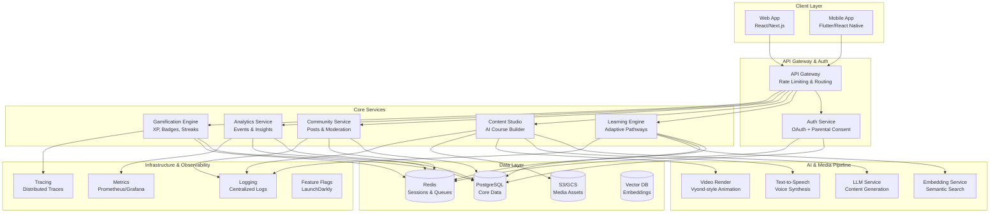
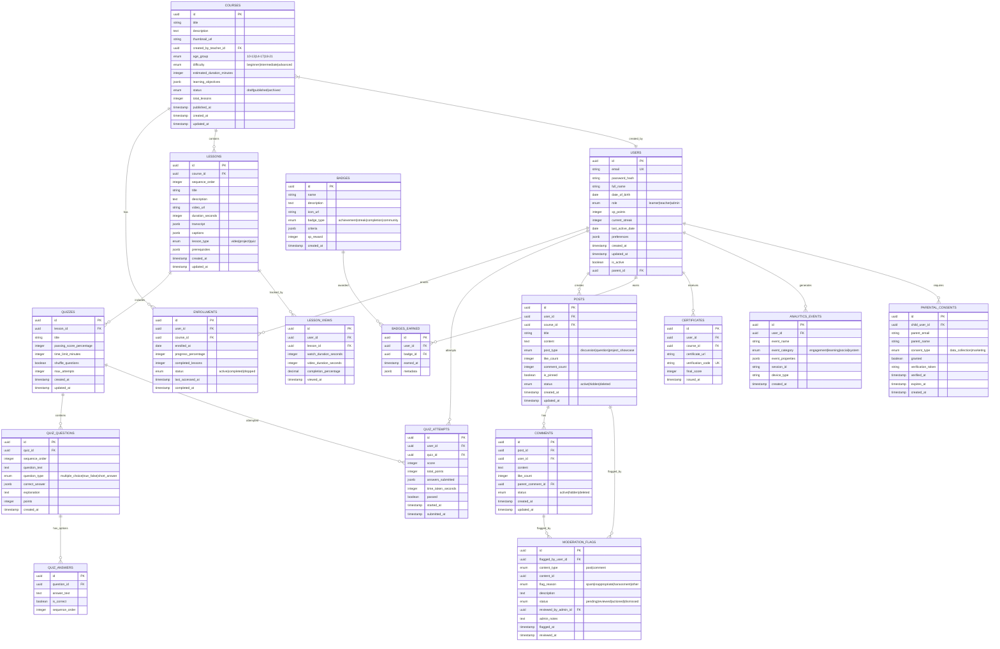

# NDUVA Life Learning Platform - Technical Architecture

## Executive Summary

NDUVA is an adaptive, gamified learning platform for ages 10-21, featuring Vyond-style animated lessons, AI-powered content creation, project-based learning, and community engagement with robust safety controls.

### Brand Voice
- Clear, warm, slightly playful
- Avoid jargon
- Encourage growth and exploration

### Core Principles
- **Mobile-first**: Responsive design, touch-optimized
- **Accessible**: WCAG 2.1 AA compliant
- **Privacy by design**: COPPA & GDPR compliant
- **Evidence of learning**: Reflection + application through projects
- **Healthy motivation**: Streaks/XP without addiction patterns
- **Teacher empowerment**: AI-assisted course creation

---

## 1. High-Level Architecture

### System Components



### Service Responsibilities

#### 1. **API Gateway**
- Request routing
- Rate limiting (by user role, endpoint)
- Request/response transformation
- SSL termination
- CORS handling

#### 2. **Auth Service**
- OAuth 2.0 / OpenID Connect
- Email/password authentication
- Parental consent flows (under 13)
- Session management
- Role-based access control (RBAC)
- JWT token issuance

#### 3. **Learning Engine**
- Course enrollment management
- Lesson progression tracking
- Quiz/assessment delivery
- Adaptive pathway calculation
- Mastery scoring
- Certificate generation

#### 4. **Content Studio**
- AI-assisted course creation
- Script generation (LLM)
- Storyboard tools
- Animation scene builder
- TTS voice generation
- Caption/subtitle management
- Content publishing workflow

#### 5. **Community Service**
- Discussion forums
- User posts & comments
- Moderation queue
- Content flagging
- Automated safety filters
- Escalation workflows

#### 6. **Analytics Service**
- Event ingestion
- Real-time metrics
- Student progress dashboards
- Teacher analytics
- Admin reports
- A/B test tracking

#### 7. **Gamification Engine**
- XP calculation
- Badge awards
- Streak tracking
- Weekly quest generation
- Leaderboard management
- Reward distribution

### Data Flow Patterns

#### Learning Flow
```
Student → Enroll in Course
       → Start Lesson (video + quiz)
       → Submit Quiz Attempt
       → Earn XP & Update Progress
       → Adaptive Engine → Recommend Next Lesson
```

#### Content Creation Flow
```
Teacher → Input Learning Objectives
        → AI generates script
        → Review/Edit Script
        → AI generates storyboard
        → Render animation
        → Generate TTS audio
        → Add captions
        → Publish course
```

#### Community Interaction Flow
```
User → Create Post
     → Automated Filter Check
     → (If flagged) → Moderation Queue
     → (If approved) → Publish
     → Other users engage (like, comment)
```

### Integration Points

#### External AI Services
- **LLM Provider**: OpenAI GPT-4 / Anthropic Claude
  - Course script generation
  - Quiz question generation
  - Feedback personalization
  
- **TTS Provider**: ElevenLabs / Google Cloud TTS
  - Voice synthesis for lessons
  - Multiple voice profiles
  
- **Animation Render**: Custom Vyond-style engine
  - Scene composition
  - Character animation
  - Asset library

#### Storage Strategy
- **PostgreSQL**: Transactional data, user profiles, course structure
- **Redis**: Session store, task queues, real-time leaderboards
- **S3/GCS**: Video files, images, audio, exported certificates
- **Vector DB**: Semantic embeddings for content search

#### Security & Compliance
- **Zero-trust architecture**: Service-to-service mTLS
- **Data encryption**: At rest (AES-256) and in transit (TLS 1.3)
- **PII minimization**: Store only essential data
- **Audit logging**: All data access logged
- **Parental consent**: Verifiable parental consent for users under 13

---

## Deployment Topology

### Production Environment

```
┌─────────────────────────────────────┐
│         CDN (CloudFlare)            │
│  Static Assets, Video Streaming     │
└─────────────────────────────────────┘
                  │
┌─────────────────────────────────────┐
│      Load Balancer (ALB/NLB)        │
│     SSL Termination, DDoS           │
└─────────────────────────────────────┘
                  │
┌─────────────────────────────────────┐
│    Kubernetes Cluster (EKS/GKE)     │
│                                     │
│  ┌──────────┐  ┌──────────┐        │
│  │  Web App │  │   API    │        │
│  │  (Pods)  │  │ Services │        │
│  └──────────┘  └──────────┘        │
│                                     │
│  ┌──────────┐  ┌──────────┐        │
│  │  Workers │  │  AI Jobs │        │
│  │ (Async)  │  │ (Render) │        │
│  └──────────┘  └──────────┘        │
└─────────────────────────────────────┘
                  │
┌─────────────────────────────────────┐
│       Managed Services              │
│  - RDS (PostgreSQL)                 │
│  - ElastiCache (Redis)              │
│  - S3 (Object Storage)              │
│  - Pinecone (Vector DB)             │
└─────────────────────────────────────┘
```

### Scalability Patterns
- **Horizontal scaling**: Auto-scale pods based on CPU/memory
- **Database read replicas**: Separate read/write workloads
- **Cache-aside pattern**: Redis for hot data
- **Event-driven architecture**: Message queues for async work
- **CDN offloading**: Static assets and video streaming

### Disaster Recovery
- **RTO (Recovery Time Objective)**: 4 hours
- **RPO (Recovery Point Objective)**: 15 minutes
- **Multi-region backup**: Cross-region database replication
- **Backup schedule**: Continuous WAL archiving + daily snapshots
- **Failover**: Automated DNS failover to standby region

---

## 2. Entity Relationship Diagram & Data Contracts

### Core Entities Overview



### Data Contracts (JSON Schemas)

#### User Schema
```json
{
  "$schema": "http://json-schema.org/draft-07/schema#",
  "type": "object",
  "properties": {
    "id": { "type": "string", "format": "uuid" },
    "email": { "type": "string", "format": "email" },
    "full_name": { "type": "string", "minLength": 2, "maxLength": 100 },
    "date_of_birth": { "type": "string", "format": "date" },
    "role": { "type": "string", "enum": ["learner", "teacher", "admin"] },
    "xp_points": { "type": "integer", "minimum": 0 },
    "current_streak": { "type": "integer", "minimum": 0 },
    "preferences": {
      "type": "object",
      "properties": {
        "notification_enabled": { "type": "boolean" },
        "theme": { "type": "string", "enum": ["light", "dark", "auto"] },
        "language": { "type": "string" },
        "learning_pace": { "type": "string", "enum": ["relaxed", "moderate", "intensive"] }
      }
    },
    "parent_id": { "type": "string", "format": "uuid", "nullable": true }
  },
  "required": ["email", "full_name", "date_of_birth", "role"]
}
```

#### Course Schema
```json
{
  "$schema": "http://json-schema.org/draft-07/schema#",
  "type": "object",
  "properties": {
    "id": { "type": "string", "format": "uuid" },
    "title": { "type": "string", "minLength": 3, "maxLength": 200 },
    "description": { "type": "string", "maxLength": 5000 },
    "thumbnail_url": { "type": "string", "format": "uri" },
    "created_by_teacher_id": { "type": "string", "format": "uuid" },
    "age_group": { "type": "string", "enum": ["10-13", "14-17", "18-21"] },
    "difficulty": { "type": "string", "enum": ["beginner", "intermediate", "advanced"] },
    "learning_objectives": {
      "type": "array",
      "items": { "type": "string" },
      "minItems": 1,
      "maxItems": 10
    },
    "status": { "type": "string", "enum": ["draft", "published", "archived"] }
  },
  "required": ["title", "description", "created_by_teacher_id", "age_group", "difficulty"]
}
```

#### Quiz Attempt Schema
```json
{
  "$schema": "http://json-schema.org/draft-07/schema#",
  "type": "object",
  "properties": {
    "id": { "type": "string", "format": "uuid" },
    "user_id": { "type": "string", "format": "uuid" },
    "quiz_id": { "type": "string", "format": "uuid" },
    "score": { "type": "integer", "minimum": 0 },
    "total_points": { "type": "integer", "minimum": 0 },
    "answers_submitted": {
      "type": "object",
      "patternProperties": {
        "^[0-9a-f-]{36}$": {
          "type": "object",
          "properties": {
            "answer": { "type": ["string", "array", "boolean"] },
            "is_correct": { "type": "boolean" },
            "points_earned": { "type": "integer" }
          }
        }
      }
    },
    "passed": { "type": "boolean" },
    "started_at": { "type": "string", "format": "date-time" },
    "submitted_at": { "type": "string", "format": "date-time" }
  },
  "required": ["user_id", "quiz_id", "score", "total_points", "passed"]
}
```

### Storage Strategy & Retention

#### PostgreSQL Tables
- **Hot data**: Active user sessions, current enrollments, recent posts
- **Warm data**: Historical quiz attempts, older posts, analytics events
- **Partitioning**: Analytics events partitioned by month
- **Indexing**: 
  - B-tree on foreign keys and frequently queried fields
  - GiST on JSONB columns for preferences
  - Partial indexes on active/published content

#### Redis Data Structures
```
# Session Management
session:{user_id} → Hash (user data, expiry: 24h)

# Real-time Leaderboards
leaderboard:weekly → Sorted Set (score: xp_points)
leaderboard:monthly → Sorted Set (score: xp_points)

# Task Queues
queue:video_render → List (job payloads)
queue:certificate_generate → List (job payloads)

# Rate Limiting
ratelimit:{user_id}:{endpoint} → String (counter, expiry: 1h)

# Streak Cache
streak:{user_id} → Hash (last_active, current_streak, expiry: 48h)
```

#### S3/GCS Buckets
- **Videos**: `/courses/{course_id}/lessons/{lesson_id}/video.mp4`
- **Thumbnails**: `/courses/{course_id}/thumbnail.jpg`
- **Certificates**: `/certificates/{user_id}/{course_id}/cert.pdf`
- **User uploads**: `/uploads/{user_id}/{timestamp}/{filename}`
- **Lifecycle**: Archive to Glacier after 1 year

#### Vector Database (Pinecone/Weaviate)
- **Content embeddings**: Course descriptions, lesson transcripts
- **Dimension**: 1536 (OpenAI ada-002)
- **Metadata filters**: age_group, difficulty, topic
- **Use case**: Semantic course search, content recommendations

### Data Retention Policy

| Data Type | Retention Period | Action After |
|-----------|------------------|--------------|
| Active user data | Indefinite | Delete on account closure |
| Quiz attempts | 2 years | Archive to cold storage |
| Analytics events | 13 months | Aggregate & delete raw |
| Session logs | 30 days | Delete |
| Moderation flags | 1 year | Archive |
| User-generated content | Per user request | Delete (GDPR/CCPA) |
| Certificates | 10 years | Archive to S3 Glacier |
| Audit logs | 7 years | Compliance requirement |

---

## 3. API Surface Design

### API Architecture

**Protocol**: REST + GraphQL hybrid
- **REST**: CRUD operations, authentication, file uploads
- **GraphQL**: Complex queries, real-time subscriptions (learning progress, community)

**Base URL**: `https://api.nduva.com/v1`

### Authentication & Authorization

#### Auth Flow

1. **Standard Login** (Email/Password or OAuth)
```http
POST /auth/login
Content-Type: application/json

{
  "email": "student@example.com",
  "password": "securepassword"
}

Response 200:
{
  "access_token": "eyJhbGc...",
  "refresh_token": "dGhpcyBp...",
  "token_type": "Bearer",
  "expires_in": 3600,
  "user": { /* user object */ }
}
```

2. **Parental Consent Flow** (For users under 13)
```http
POST /auth/register/child
Content-Type: application/json

{
  "child": {
    "full_name": "John Doe",
    "date_of_birth": "2015-03-20",
    "email": "john@example.com"
  },
  "parent": {
    "full_name": "Jane Doe",
    "email": "jane@example.com"
  }
}

Response 201:
{
  "message": "Verification email sent to parent",
  "verification_id": "uuid",
  "status": "pending_consent"
}
```

3. **OAuth Providers**
   - Google: `/auth/oauth/google`
   - Microsoft: `/auth/oauth/microsoft`
   - Apple: `/auth/oauth/apple`

#### Auth Scopes

| Scope | Description | Roles |
|-------|-------------|-------|
| `user:read` | Read own user profile | All |
| `user:write` | Update own user profile | All |
| `course:read` | View courses | All |
| `course:write` | Create/edit courses | Teacher, Admin |
| `course:publish` | Publish courses | Teacher, Admin |
| `enrollment:manage` | Enroll in courses | Learner |
| `quiz:attempt` | Submit quiz attempts | Learner |
| `community:read` | View posts/comments | All |
| `community:write` | Create posts/comments | All |
| `moderation:manage` | Moderate content | Admin |
| `analytics:read` | View analytics | Teacher, Admin |
| `admin:all` | Full admin access | Admin |

### Core API Endpoints

#### 1. User Management

```http
# Get current user
GET /users/me
Authorization: Bearer {token}
Response: User object

# Update user profile
PATCH /users/me
Authorization: Bearer {token}
Content-Type: application/json
Body: Partial User object
Response: Updated User object

# Get user's XP and streaks
GET /users/me/gamification
Authorization: Bearer {token}
Response: {
  "xp_points": 1250,
  "current_streak": 7,
  "badges_earned": 5,
  "rank": "Bronze Scholar"
}

# Rate Limit: 100 req/hour per user
```

#### 2. Course Management

```http
# List courses (with filters)
GET /courses?age_group=14-17&difficulty=beginner&page=1&limit=20
Authorization: Bearer {token}
Response: {
  "data": [Course[]],
  "pagination": {
    "page": 1,
    "total_pages": 5,
    "total_items": 100
  }
}

# Get course details
GET /courses/{courseId}
Authorization: Bearer {token}
Response: Course object with lessons[]

# Create course (Teacher only)
POST /courses
Authorization: Bearer {token}
Scope: course:write
Content-Type: application/json
Body: {
  "title": "Financial Literacy 101",
  "description": "...",
  "age_group": "14-17",
  "difficulty": "beginner",
  "learning_objectives": ["Understand budgeting", "..."]
}
Response 201: Created Course object

# Update course
PATCH /courses/{courseId}
Authorization: Bearer {token}
Scope: course:write
Content-Type: application/json
Body: Partial Course object

# Publish course
POST /courses/{courseId}/publish
Authorization: Bearer {token}
Scope: course:publish
Response: { "status": "published", "published_at": "2024-01-15T10:00:00Z" }

# Rate Limit: 
#  - GET: 500 req/hour
#  - POST/PATCH: 100 req/hour
```

#### 3. Enrollment & Progress

```http
# Enroll in course
POST /enrollments
Authorization: Bearer {token}
Scope: enrollment:manage
Content-Type: application/json
Body: { "course_id": "uuid" }
Response 201: Enrollment object

# Get my enrollments
GET /enrollments/me?status=active
Authorization: Bearer {token}
Response: Enrollment[]

# Get enrollment progress
GET /enrollments/{enrollmentId}/progress
Authorization: Bearer {token}
Response: {
  "enrollment_id": "uuid",
  "progress_percentage": 65,
  "completed_lessons": 13,
  "total_lessons": 20,
  "current_lesson": { /* lesson object */ },
  "next_lesson": { /* adaptive recommendation */ }
}

# Mark lesson as viewed
POST /enrollments/{enrollmentId}/lessons/{lessonId}/view
Authorization: Bearer {token}
Content-Type: application/json
Body: {
  "watch_duration_seconds": 120,
  "completion_percentage": 100
}
Response: { "xp_earned": 50, "lesson_completed": true }

# Rate Limit: 200 req/hour
```

#### 4. Quizzes & Assessments

```http
# Get quiz
GET /quizzes/{quizId}
Authorization: Bearer {token}
Response: Quiz with questions[] (without correct answers)

# Submit quiz attempt
POST /quiz-attempts
Authorization: Bearer {token}
Scope: quiz:attempt
Content-Type: application/json
Body: {
  "quiz_id": "uuid",
  "answers": {
    "question_uuid": { "answer": "option_a" },
    "question_uuid_2": { "answer": ["opt1", "opt2"] }
  },
  "time_taken_seconds": 300
}
Response 201: {
  "attempt_id": "uuid",
  "score": 85,
  "total_points": 100,
  "passed": true,
  "xp_earned": 100,
  "feedback": { /* detailed feedback per question */ }
}

# Get quiz attempts history
GET /quiz-attempts?user_id=me&quiz_id={quizId}
Authorization: Bearer {token}
Response: QuizAttempt[]

# Rate Limit: 50 quiz attempts/day per user
```

#### 5. Adaptive Learning

```http
# Get personalized recommendations
GET /recommendations/next-lessons
Authorization: Bearer {token}
Query Params:
  - enrollment_id: uuid
  - count: integer (default: 5)
Response: {
  "recommendations": [
    {
      "lesson_id": "uuid",
      "lesson": { /* lesson object */ },
      "reason": "Based on your progress in similar topics",
      "confidence_score": 0.87
    }
  ]
}

# Get learning path
GET /recommendations/learning-path
Authorization: Bearer {token}
Query Params:
  - enrollment_id: uuid
Response: {
  "path": [
    { "lesson_id": "uuid", "sequence": 1, "estimated_duration": 15 },
    { "lesson_id": "uuid", "sequence": 2, "estimated_duration": 20 }
  ],
  "total_duration_minutes": 180,
  "adaptive_adjustments": []
}

# Rate Limit: 100 req/hour
```

#### 6. Community

```http
# List posts (with filters)
GET /posts?course_id={uuid}&post_type=discussion&page=1
Authorization: Bearer {token}
Response: {
  "data": Post[],
  "pagination": { /* ... */ }
}

# Create post
POST /posts
Authorization: Bearer {token}
Scope: community:write
Content-Type: application/json
Body: {
  "course_id": "uuid",
  "title": "How to budget effectively?",
  "content": "I'm struggling with...",
  "post_type": "question"
}
Response 201: Post object

# Add comment
POST /posts/{postId}/comments
Authorization: Bearer {token}
Content-Type: application/json
Body: {
  "content": "Great question! Here's my approach...",
  "parent_comment_id": null
}
Response 201: Comment object

# Flag content
POST /moderation/flag
Authorization: Bearer {token}
Content-Type: application/json
Body: {
  "content_type": "post",
  "content_id": "uuid",
  "flag_reason": "inappropriate",
  "description": "Contains offensive language"
}
Response 201: { "flag_id": "uuid", "status": "pending" }

# Rate Limit:
#  - GET: 500 req/hour
#  - POST: 50 posts/day, 200 comments/day
```

#### 7. Gamification

```http
# Get user badges
GET /badges/me
Authorization: Bearer {token}
Response: {
  "badges_earned": [
    {
      "badge": { /* badge object */ },
      "earned_at": "2024-01-10T14:30:00Z"
    }
  ],
  "next_badges": [ /* badges close to earning */ ]
}

# Get leaderboard
GET /leaderboard?type=weekly&limit=100
Authorization: Bearer {token}
Response: {
  "leaderboard": [
    {
      "rank": 1,
      "user": { "id": "uuid", "full_name": "Jane D." },
      "xp_points": 2500,
      "badges_count": 12
    }
  ],
  "my_rank": 45
}

# Get weekly quests
GET /quests/weekly
Authorization: Bearer {token}
Response: {
  "quests": [
    {
      "id": "uuid",
      "title": "Complete 5 lessons this week",
      "progress": 3,
      "target": 5,
      "xp_reward": 200,
      "expires_at": "2024-01-21T23:59:59Z"
    }
  ]
}

# Rate Limit: 200 req/hour
```

#### 8. Analytics (Teacher/Admin)

```http
# Get student analytics
GET /analytics/students/{studentId}
Authorization: Bearer {token}
Scope: analytics:read
Response: {
  "student_id": "uuid",
  "total_courses_enrolled": 5,
  "courses_completed": 2,
  "average_quiz_score": 87.5,
  "total_xp": 3500,
  "learning_pace": "moderate",
  "engagement_metrics": {
    "lessons_per_week": 4.2,
    "avg_session_duration_minutes": 25
  }
}

# Get course analytics
GET /analytics/courses/{courseId}
Authorization: Bearer {token}
Scope: analytics:read
Response: {
  "enrollment_count": 1250,
  "completion_rate": 67.5,
  "average_rating": 4.6,
  "lesson_performance": [ /* per-lesson stats */ ]
}

# Rate Limit: 100 req/hour
```

#### 9. Content Studio (AI-Assisted)

```http
# Generate course script
POST /content-studio/generate-script
Authorization: Bearer {token}
Scope: course:write
Content-Type: application/json
Body: {
  "topic": "Introduction to Budgeting",
  "age_group": "14-17",
  "duration_minutes": 10,
  "learning_objectives": ["Understand income vs expenses", "..."]
}
Response 202: {
  "job_id": "uuid",
  "status": "processing",
  "estimated_completion_seconds": 30
}

# Check script generation status
GET /content-studio/jobs/{jobId}
Authorization: Bearer {token}
Response: {
  "job_id": "uuid",
  "status": "completed",
  "result": {
    "script": "Welcome to budgeting basics...",
    "scenes": [ /* storyboard */ ]
  }
}

# Render video
POST /content-studio/render-video
Authorization: Bearer {token}
Content-Type: application/json
Body: {
  "script": "...",
  "scenes": [ /* ... */ ],
  "voice_id": "professional_female",
  "background_music": true
}
Response 202: {
  "render_job_id": "uuid",
  "status": "queued",
  "estimated_completion_minutes": 5
}

# Rate Limit: 10 AI generations/hour per teacher
```

### GraphQL Schema (Subset)

```graphql
type Query {
  me: User!
  course(id: ID!): Course
  courses(filters: CourseFilters, page: Int, limit: Int): CoursePage!
  enrollment(id: ID!): Enrollment
  myEnrollments(status: EnrollmentStatus): [Enrollment!]!
  recommendations(enrollmentId: ID!, count: Int): [LessonRecommendation!]!
  leaderboard(type: LeaderboardType!, limit: Int): Leaderboard!
  posts(filters: PostFilters, page: Int): PostPage!
}

type Mutation {
  enrollInCourse(courseId: ID!): Enrollment!
  submitQuizAttempt(input: QuizAttemptInput!): QuizAttemptResult!
  createPost(input: CreatePostInput!): Post!
  flagContent(input: FlagContentInput!): ModerationFlag!
  updateUserPreferences(input: UserPreferencesInput!): User!
}

type Subscription {
  lessonProgress(enrollmentId: ID!): LessonProgressUpdate!
  liveLeaderboard(type: LeaderboardType!): LeaderboardUpdate!
  communityActivity(courseId: ID!): CommunityUpdate!
}
```

### Rate Limiting Strategy

#### Tier-based Limits

| Tier | Requests/Hour | Burst | AI Requests/Day |
|------|---------------|-------|-----------------|
| Free Learner | 500 | 100 | N/A |
| Premium Learner | 1000 | 200 | N/A |
| Teacher | 2000 | 400 | 100 |
| Admin | 10000 | 2000 | 500 |

#### Endpoint-Specific Limits
- **Quiz Attempts**: Max 50/day per user
- **Post Creation**: Max 20/day per user
- **Comment Creation**: Max 100/day per user
- **AI Content Generation**: 10/hour for teachers
- **Video Upload**: Max 5GB/day per teacher

#### Rate Limit Headers
```http
X-RateLimit-Limit: 1000
X-RateLimit-Remaining: 847
X-RateLimit-Reset: 1704672000
```

### Error Responses

#### Standard Error Format
```json
{
  "error": {
    "code": "VALIDATION_ERROR",
    "message": "Invalid input data",
    "details": [
      {
        "field": "age_group",
        "message": "Must be one of: 10-13, 14-17, 18-21"
      }
    ],
    "request_id": "req_abc123",
    "timestamp": "2024-01-15T10:30:00Z"
  }
}
```

#### Error Codes

| Code | HTTP Status | Description |
|------|-------------|-------------|
| `AUTHENTICATION_REQUIRED` | 401 | Missing or invalid token |
| `INSUFFICIENT_PERMISSIONS` | 403 | Lacks required scope |
| `RESOURCE_NOT_FOUND` | 404 | Requested resource doesn't exist |
| `VALIDATION_ERROR` | 422 | Invalid input data |
| `RATE_LIMIT_EXCEEDED` | 429 | Too many requests |
| `PARENTAL_CONSENT_REQUIRED` | 451 | User under 13 needs consent |
| `INTERNAL_ERROR` | 500 | Server error |

### API Versioning

- **URL Versioning**: `/v1/`, `/v2/`
- **Header Versioning**: `API-Version: 2024-01-15`
- **Deprecation Policy**: 6-month notice, 12-month support
- **Sunset Header**: `Sunset: Sat, 31 Dec 2024 23:59:59 GMT`

---

*Next: Adaptive Engine Design*
